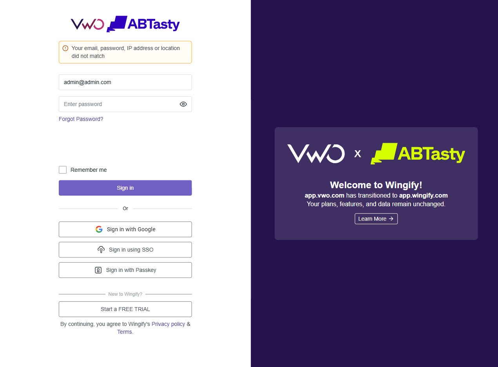
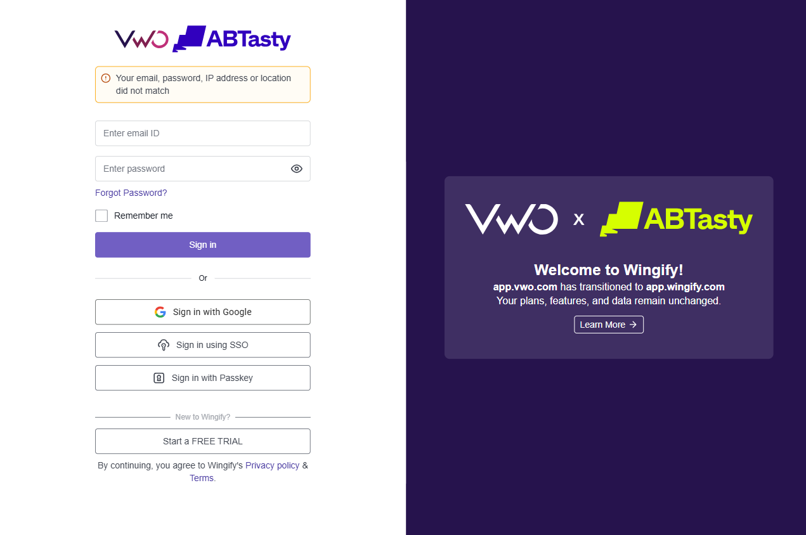
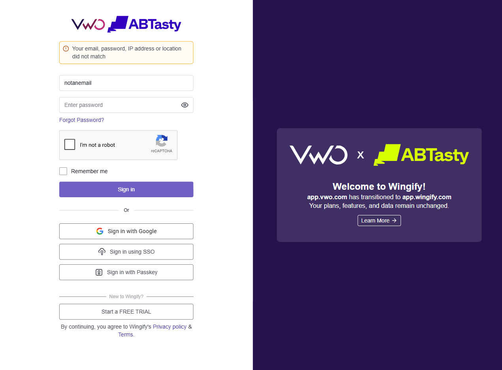

# VWO Login — Validation & Error Handling

**Test File:** `tests/Locators_Commands/Project_VWO_Login.spec.ts`  
**Application URL:** https://app.vwo.com/#/login  
**Browser:** Chromium  

## Objective

Test the VWO login form validation and error handling with various invalid input scenarios.

## Test Cases

### TC#1 — Invalid credentials shows error message

Verify that entering a wrong email/password combo displays the appropriate error.

| Step | Action | Screenshot |
|------|--------|------------|
| 1 | Navigate to VWO login page |  |
| 2 | Fill email and password with invalid credentials |  |
| 3 | Click Sign In and verify error message |  |

### TC#2 — Empty email field validation

Verify behavior when the email field is left empty.

| Step | Action | Screenshot |
|------|--------|------------|
| 1 | Navigate to VWO login page |  |
| 2 | Fill password only, leave email blank |  |
| 3 | Click Sign In and capture result |  |

### TC#3 — Invalid email format (missing domain)

Verify behavior when the email doesn't contain a valid domain format.

| Step | Action | Screenshot |
|------|--------|------------|
| 1 | Navigate to VWO login page |  |
| 2 | Fill email with `"notanemail"` (no `@` domain) |  |
| 3 | Click Sign In and capture result |  |

## Locators Used

| Element | Locator |
|---------|---------|
| Email field | `#login-username` |
| Password field | `#login-password` |
| Sign In button | `#js-login-btn` |
| Error notification | `#js-notification-box-msg` |

## Expected Results

| TC# | Scenario | Expected |
|-----|----------|----------|
| 1 | Invalid credentials | Error message: *"Your email, password, IP address or location did not match"* |
| 2 | Empty email | Form fails to submit or shows validation |
| 3 | Invalid email format | Form fails to submit or shows validation |

## Run

```bash
npx playwright test "tests/Locators_Commands/Project_VWO_Login.spec.ts"
```
